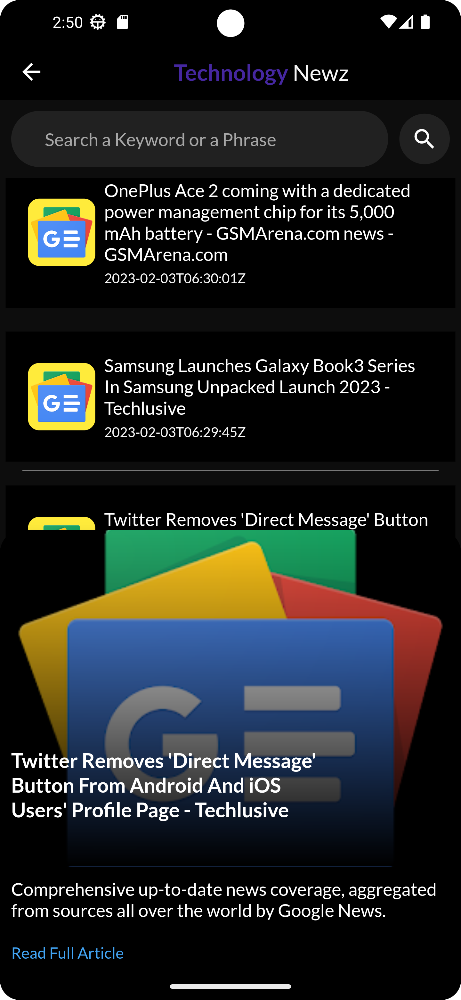

# Newz Hub

 This app is made using Flutter & News API. The news details are fetched dynamically & the news is arranged on the basis of the events happened.

# Screenshots

  

  

  

----------------> There are some issues regarding the images which will be solved soon and more things will be added in future.

A few resources to get you started if this is your first Flutter project:

- [Lab: Write your first Flutter app](https://docs.flutter.dev/get-started/codelab)
- [Cookbook: Useful Flutter samples](https://docs.flutter.dev/cookbook)

For help getting started with Flutter development, view the
[online documentation](https://docs.flutter.dev/), which offers tutorials,
samples, guidance on mobile development, and a full API reference.
